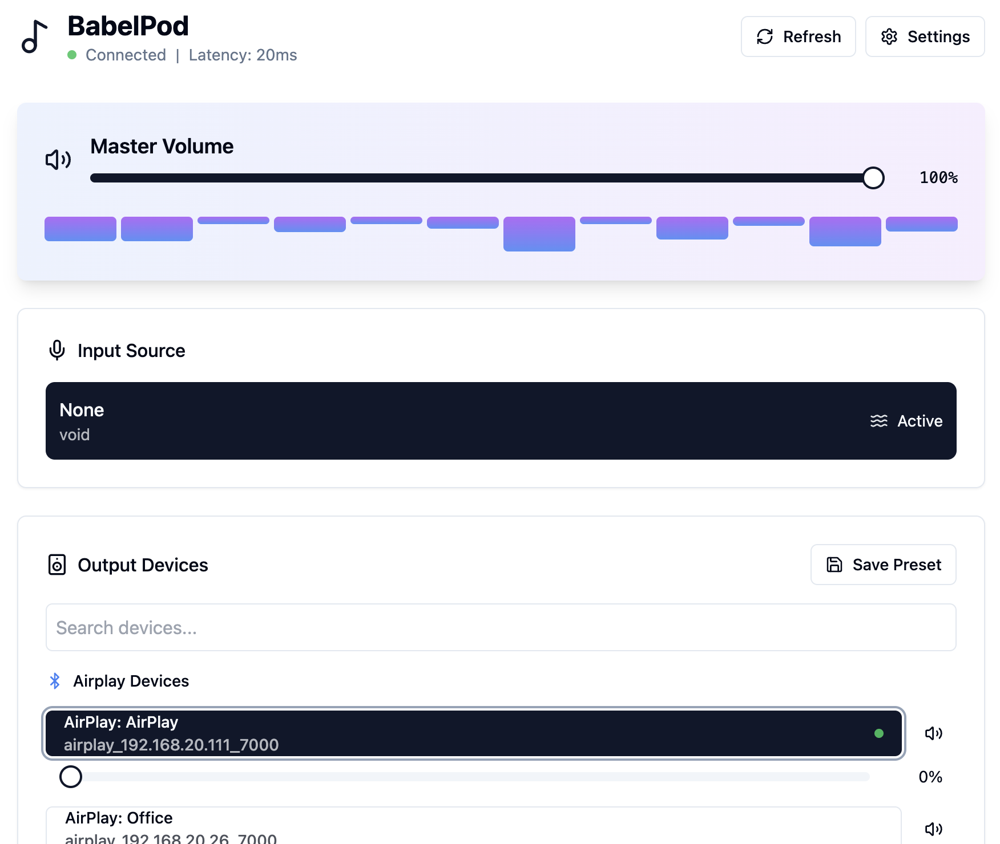

# BabelPod

A modern audio routing system that connects various inputs (Line-in, Bluetooth, PCM) to different outputs (AirPlay speakers including HomePod, Bluetooth devices, PCM outputs). Built with cross-platform support and a modern React frontend.

## Features

### Audio Routing
- **Multiple Input Types:**
  - Line-in audio sources
  - Bluetooth devices
  - PCM audio devices
  - Virtual/void devices
- **Multiple Output Types:**
  - AirPlay speakers (including HomePod)
  - Bluetooth audio devices
  - PCM audio outputs
  - Multiple simultaneous outputs

### Modern Interface
- Real-time device discovery and connection
- Individual volume controls per device
- Device grouping support
- Audio preset support
- Dark mode interface optimized for touch screens
- Responsive design
- Real-time status updates

### Technical Features
- Cross-platform support (Linux and macOS)
- Native audio integration
- Low latency audio routing
- Automatic device discovery
- Graceful fallbacks for unsupported features
- TypeScript throughout
- Modern React patterns
- Socket.IO for real-time updates

## Prerequisites

### For Raspberry Pi (Raspbian):

1. Install required packages:
```bash
# Audio and Bluetooth dependencies
sudo apt-get update
sudo apt-get install -y bluez pulseaudio-module-bluetooth
sudo apt-get install -y libasound2-dev avahi-daemon
```

2. Configure Bluetooth service permissions:
```bash
# Create a new policy file
sudo nano /etc/polkit-1/localauthority/50-local.d/46-allow-bluetooth-service.pkla
```

Add this content:
```ini
[Allow users to manage bluetooth service]
Identity=unix-group:bluetooth
Action=org.freedesktop.systemd1.manage-units;org.freedesktop.systemd1.manage-unit-files
ResultAny=yes
ResultInactive=yes
ResultActive=yes
```

3. Set up user permissions:
```bash
# Create bluetooth group and add your user
sudo usermod -aG bluetooth $USER

# Add user to audio group
sudo usermod -aG audio $USER
```

4. Configure Bluetooth settings:
```bash
sudo nano /etc/bluetooth/main.conf
```

Add these lines:
```ini
[Policy]
AutoEnable=true

[General]
ControllerMode = bredr
```

5. Apply changes:
```bash
# Restart Bluetooth service
sudo systemctl restart bluetooth

# Reboot to apply all changes
sudo reboot
```

### For Other Linux Distributions:

1. Install required packages:
```bash
# Audio and Bluetooth dependencies
sudo apt-get install bluez pulseaudio-module-bluetooth
sudo apt-get install libasound2-dev avahi-daemon
```

2. Configure Bluetooth permissions:
```bash
# Create a new polkit rule file
sudo nano /etc/polkit-1/rules.d/51-bluetooth.rules
```

Add this content:
```javascript
polkit.addRule(function(action, subject) {
    if ((action.id == "org.bluez.device.pair" ||
         action.id == "org.bluez.device.connect" ||
         action.id == "org.bluez.device.disconnect" ||
         action.id == "org.bluez.adapter.discoverable" ||
         action.id == "org.bluez.adapter.bondable" ||
         action.id == "org.bluez.adapter.blocked") &&
        subject.local && subject.active && subject.isInGroup("bluetooth")) {
            return polkit.Result.YES;
    }
});
```

3. Set up user permissions:
```bash
# Create bluetooth group and add your user
sudo groupadd -f bluetooth
sudo usermod -aG bluetooth $USER

# Add user to audio group
sudo usermod -aG audio $USER
```

4. Configure Bluetooth settings:
```bash
sudo nano /etc/bluetooth/main.conf
```

Add these lines:
```ini
[Policy]
AutoEnable=true

[General]
ControllerMode = bredr
```

5. Apply changes:
```bash
# Restart Bluetooth service
sudo systemctl restart bluetooth

# Log out and log back in for group changes to take effect
```

### For macOS:
```bash
# Install required utilities
brew install blueutil switchaudio-osx sox
```

## Installation

1. Clone the repository:
```bash
git clone https://github.com/gsperry/babelpod.git
cd babelpod
```

2. Install Node.js dependencies:
```bash
npm install
```

3. Build the application:
```bash
npm run build
```

4. Start the server:
```bash
npm start
```

The web interface will be available at `http://localhost:3000`

## Development

To run in development mode with hot reloading:

```bash
npm run dev
```

This will start both the backend server and frontend development server.

## Architecture

### Frontend
- React with TypeScript
- Tailwind CSS for styling
- Socket.IO for real-time communication
- shadcn/ui for component library

### Backend
- Node.js with Express
- Socket.IO for real-time communication
- Platform-specific audio integrations:
  - Linux: ALSA, PulseAudio, BlueZ
  - macOS: CoreAudio, BlueUtil

### Audio Routing
- AirPlay: node_airtunes2
- PCM: Platform-specific implementations
- Bluetooth: Platform-specific implementations with fallbacks

## Platform Support

### Linux
- Full support for all features
- Uses native ALSA and PulseAudio
- D-Bus for Bluetooth (with command-line fallback)
- AirPlay support via node_airtunes2

### macOS
- AirPlay support
- Native Bluetooth support
- CoreAudio integration
- Some features may require additional permissions

## Contributing

Contributions are welcome! Please read [CONTRIBUTING.md](CONTRIBUTING.md) for details on our code of conduct and the process for submitting pull requests.

## Authors

- [**Guy Sperry**](https://github.com/gsperry) - *Modern rewrite, Bluetooth support, cross-platform compatibility*
- [**Andrew Faden**](https://github.com/afaden) - *Original creator*

## License

This project is licensed under the MIT License - see the [LICENSE.md](LICENSE.md) file for details.

## Acknowledgments

- Original BabelPod project by Andrew Faden
- [node_airtunes2](https://github.com/ciderapp/node_airtunes2) for AirPlay functionality
- [shadcn/ui](https://ui.shadcn.com/) for React components
- [Tailwind CSS](https://tailwindcss.com/) for styling
- [Socket.IO](https://socket.io/) for real-time communication

## Screenshots

